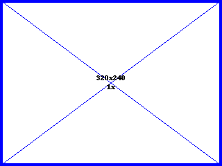
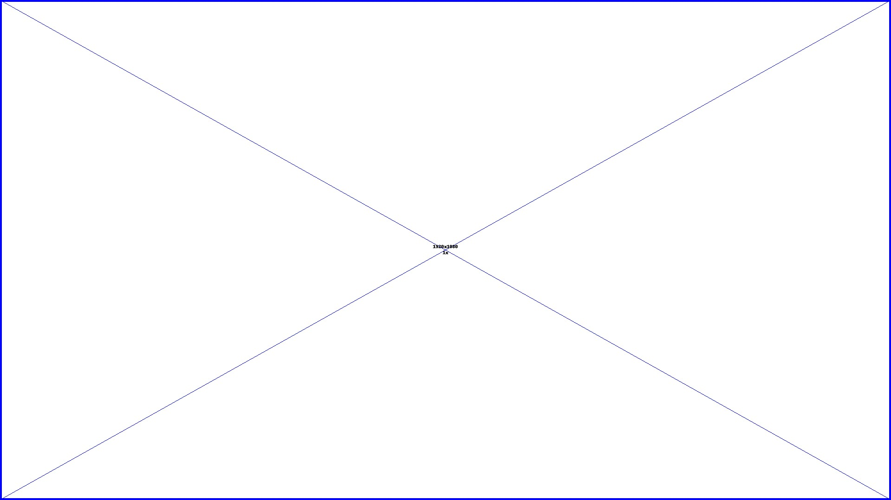

# Heading 1

`!!! include(__lorem.md) !!!`
`!!! include(__lorem.md) !!!`

## Heading 2

`!!! include(__lorem.md) !!!`
`!!! include(__lorem.md) !!!`

### Heading 3

`!!! include(__lorem.md) !!!`
`!!! include(__lorem.md) !!!`

#### Heading 4

`!!! include(__lorem.md) !!!`
`!!! include(__lorem.md) !!!`

##### Heading 5

`!!! include(__lorem.md) !!!`
`!!! include(__lorem.md) !!!`

###### Heading 6

`!!! include(__lorem.md) !!!`
`!!! include(__lorem.md) !!!`

## Image example

`!!! include(__lorem.md) !!!`
`!!! include(__lorem.md) !!!`
`!!! include(__lorem.md) !!!`
`!!! include(__lorem.md) !!!`

::: .group


`!!! include(__lorem.md) !!!`
:::

::: .group
`!!! include(__lorem.md) !!!`



`!!! include(__lorem.md) !!!`
:::


## Element example

### Inline

`Code`
_Emphasis_
**String**
~~Strike~~

### Footnote

Footnote [^1]

[^1]: Footnote 1

Footnote [^2]

[^2]: Footnote 2

### List

- Unordered list
  - Unordered list
  - Unordered list
    - Unordered list
    - Unordered list
- Unordered list
  - Unordered list
  - Unordered list
    - Unordered list
    - Unordered list

1. Ordered list
   1. Ordered list
   2. Ordered list
      1. Ordered list
      2. Ordered list
2. Ordered list
   1. Ordered list
   2. Ordered list
      1. Ordered list
      2. Ordered list

### Pre-formatted

```
pre-formatted
```

### Blockquote

> `!!! include(__lorem.md) !!!`

### Table

| Header 1       | Table Header 2 | Header 3       |
| -------------- | -------------- | -------------- |
| Table Data 1-1 | Data 1-2       | Data 1-3       |
| Data 2-1       | Table Data 2-2 | Data 2-3       |
| Data 3-1       | Data 3-2       | Table Data 3-3 |
| Data 4-1       | Data 4-2       | Data 4-3       |

| Header 1       | Table Header 2 |       Header 3 |
| :------------- | :------------: | -------------: |
| Table Data 1-1 |    Data 1-2    |       Data 1-3 |
| Data 2-1       | Table Data 2-2 |       Data 2-3 |
| Data 3-1       |    Data 3-2    | Table Data 3-3 |
| Data 4-1       |    Data 4-2    |       Data 4-3 |
